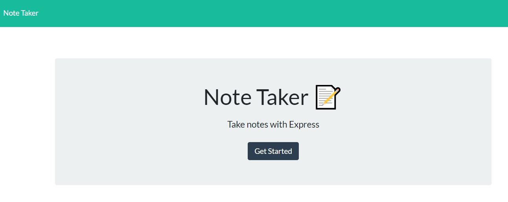
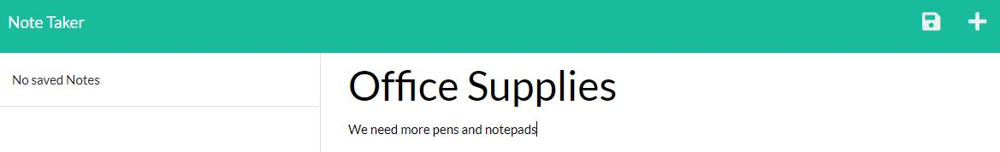
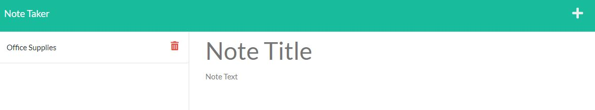

# Note Taker

## Description
The Note Taker is used for creating and saving notes or other to-dos. This project was developed using Insomnia to test different GET and POST routes. The motivation for this project was to get practice using Insomnia and to use an express server to store the user's notes. This project is deployed using Heroku.  
 
Further Development: 
- update the note list automatically so the user does not have to refresh the page
- make the delete button functional to the user can remove notes that are no longer needed

## Link to Deployed Application

## Installation
N/A

## Usage
>To begin using the app, click the 'Get Started' button

>To create a new note, simply enter a new title and text for the note.

>To save the note, click the save icon in the upper right corner of the app.

>After refreshing the page, the saved note now appears on the left side of the app.

## License
MIT license. Please refer to the license in the repo.
