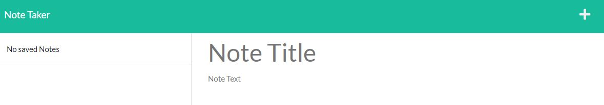

# Note Taker

## Description
The Note Taker is used for creating and saving notes or other to-dos. This project was developed using Insomnia to test different GET and POST routes. The motivation for this project was to get practice using Insomnia and to use an express server to run the app. This project is deployed using Heroku.  
 
Further Development: 
- make the delete button functional to the user can remove notes that are no longer needed

## Link to Deployed Application
[Link to Deployed App](https://pure-mesa-19831.herokuapp.com/)

## Installation
N/A

## Usage
>To begin using the app, click the 'Get Started' button

>To create a new note, simply enter a new title and text for the note.

>To save the note, click the save icon in the upper right corner of the page.

>The saved note now appears in the list on the left side of the page.

>To view a note again simply click on the title of the note in the list.

## License
MIT license. Please refer to the license in the repo.
